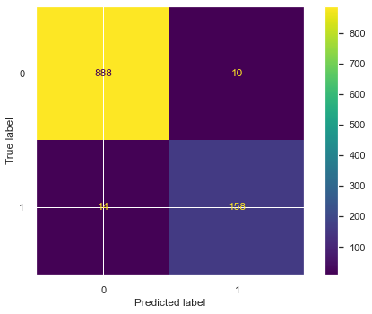

<h1 align="center"> E-Commerce Customer Churn Prediction </h1>

    

# Problem Statements
Churn rate adalah rasio pelanggan yang berhenti berlangganan dengan perusahaan dalam periode waktu tertentu. Salah satu mekanisme terbaik untuk mempertahankan pelanggan saat ini adalah mengidentifikasi potensi churn dan merespon dengan cepat untuk mencegahnya. Teknik data mining dapat diterapkan untuk menganalisis perilaku pelanggan dan untuk memprediksi pengurangan pelanggan (churn) potensial sehingga strategi pemasaran khusus dapat diadopsi untuk mempertahankannya.

## Business Question
1. Berapa persen customer yang memilih untuk churn ?
2. Apakah jenis kelamin berpengaruh terhadap kemungkinan customer untuk churn?
3. Apakah ada pengaruh antara tenure dengan churn rate?
4. Apakah jarak rumah customer dengan warehouse memiliki pengaruh terhadap churn?
5. Apakah customer yang komplain cenderung akan memilih untuk churn ?
6. Bagaimana churn rate berdasarkan kategori produk yang dibeli customer ?
7. Bagaiman churn rate berdasarkan metode pembayaran yang digunakan

## Goal
1. Mengidentifikasi penyebab churn.
2. Membangun machine learning untuk mendeteksi customer yang akan churn.

## Data Dictionary
|           Variable          |                           Description                           |
|:---------------------------:|:---------------------------------------------------------------:|
| CustomerID                  | Unique customer ID                                              |
| Churn                       | Churn Flag                                                      |
| Tenure                      | Tenure of customer in   organization                            |
| PreferredLoginDevice        | Preferred login   device of customer                            |
| CityTier                    | City tier                                                       |
| WarehouseToHome             | Distance in between   warehouse to home of customer             |
| PreferredPaymentMode        | Preferred payment   method of customer                          |
| Gender                      | Gender of customer                                              |
| HourSpendOnApp              | Number of hours spend   on mobile application or website        |
| NumberOfDeviceRegistered    | Total number of   deceives is registered on particular customer |
| PreferedOrderCat            | Preferred order   category of customer in last month            |
| SatisfactionScore           | Satisfactory score of   customer on service                     |
| MaritalStatus               | Marital status of   customer                                    |
| NumberOfAddress             | Total number of added   added on particular customer            |
| Complain                    | Any complaint has   been raised in last month                   |
| OrderAmountHikeFromlastYear | Percentage increases   in order from last year                  |
| CouponUsed                  | Total number of   coupon has been used in last month            |
| OrderCount                  | Total number of   orders has been places in last month          |
| DaySinceLastOrder           | Day Since last order   by customer                              |
| CashbackAmount              | Average cashback in   last month                                |

# Work Steps
1. Problem Statement
   - Context
   - Business Questions
   - Goals
   - Data Dictionary
2. Data Exploration
   - Load Dataset
   - Data Information
   - Statistics Descriptive
   - Check Null Values
   - Check Duplicated Data
3. Data Cleansing
   - Handling Missing Values
   - Handling Inconsistent Data
   - Handling Outliers
4. Exploratory Data Analysis
   - Univariate Analysis
   - Multivariate Analysis
5. Feature Engineering
   - Add New Features
   - Remove Unnecessary Features
   - Feature Encoding 
   - Feature Scaling 
6. Sampling Dataset 
   - Separate Train and Test Set
   - Oversampling Using SMOTE
7. Modelling
   - Choose Best Model
   - Feature Selection using Recursive Feature Elimination
   - Hyperparameter Tuning
8. Model Evaluation
   - Confusion Matrix
   - Classification Report
   - Precision Recall and ROC Curve
   - Feature Importance
   - Thresholds Adjustment
9. Save Model

# Dataset Preview
|   | CustomerID | Churn | Tenure | PreferredLoginDevice | CityTier | WarehouseToHome | PreferredPaymentMode | Gender | HourSpendOnApp | NumberOfDeviceRegistered |   PreferedOrderCat | SatisfactionScore | MaritalStatus | NumberOfAddress | Complain | OrderAmountHikeFromlastYear | CouponUsed | OrderCount | DaySinceLastOrder | CashbackAmount |   |
|--:|-----------:|------:|-------:|---------------------:|---------:|----------------:|---------------------:|-------:|---------------:|-------------------------:|-------------------:|------------------:|--------------:|----------------:|---------:|----------------------------:|-----------:|-----------:|------------------:|---------------:|---|
| 0 |      50001 |     1 |    4.0 |         Mobile Phone |        3 |             6.0 |           Debit Card | Female |            3.0 |                        3 | Laptop & Accessory |                 2 |        Single |               9 |        1 |                        11.0 |        1.0 |        1.0 |               5.0 |         159.93 |   |
| 1 |      50002 |     1 |    NaN |                Phone |        1 |             8.0 |                  UPI |   Male |            3.0 |                        4 |             Mobile |                 3 |        Single |               7 |        1 |                        15.0 |        0.0 |        1.0 |               0.0 |         120.90 |   |
| 2 |      50003 |     1 |    NaN |                Phone |        1 |            30.0 |           Debit Card |   Male |            2.0 |                        4 |             Mobile |                 3 |        Single |               6 |        1 |                        14.0 |        0.0 |        1.0 |               3.0 |         120.28 |   |
| 3 |      50004 |     1 |    0.0 |                Phone |        3 |            15.0 |           Debit Card |   Male |            2.0 |                        4 | Laptop & Accessory |                 5 |        Single |               8 |        0 |                        23.0 |        0.0 |        1.0 |               3.0 |         134.07 |   |
| 4 |      50005 |     1 |    0.0 |                Phone |        1 |            12.0 |                   CC |   Male |            NaN |                        3 |             Mobile |                 5 |        Single |               3 |        0 |                        11.0 |        1.0 |        1.0 |               3.0 |         129.60 |   |

# Modelling
Pada tahap modelling kita akan membandingkan beberapa metode yang nantinya kita akan pilih mana model yang menghasilkan performa terbaik. Model dengan performa terbaik yang nantinya akan kita pilih dalam tahap selanjutnya.

|    |                      Model |  fit_time | score_time | test_accuracy | test_precision | test_recall |  test_f1 |
|---:|---------------------------:|----------:|-----------:|--------------:|---------------:|------------:|---------:|
|  0 |              XGBClassifier |  2.514655 |   0.025586 |      0.994393 |       0.983622 |    0.983547 | 0.983546 |
|  1 |       ExtraTreesClassifier |  1.206610 |   0.148457 |      0.993458 |       1.000000 |    0.961635 | 0.980344 |
|  2 |     RandomForestClassifier |  1.376692 |   0.170867 |      0.989533 |       0.991036 |    0.947337 | 0.968458 |
|  3 |     DecisionTreeClassifier |  0.086550 |   0.022365 |      0.985607 |       0.951505 |    0.964907 | 0.958101 |
|  4 |          BaggingClassifier |  0.556066 |   0.027426 |      0.980374 |       0.963785 |    0.919972 | 0.941126 |
|  5 |              MLPClassifier | 11.257185 |   0.022924 |      0.968224 |       0.936284 |    0.873945 | 0.903460 |
|  6 |       KNeighborsClassifier |  0.009918 |   0.518106 |      0.922617 |       0.893178 |    0.620621 | 0.732242 |
|  7 | GradientBoostingClassifier |  2.162448 |   0.020611 |      0.921121 |       0.845352 |    0.658998 | 0.740171 |
|  8 |                        SVC |  1.362156 |   0.869904 |      0.913832 |       0.890933 |    0.563670 | 0.689508 |
|  9 |         AdaBoostClassifier |  0.814248 |   0.065768 |      0.896636 |       0.750368 |    0.589996 | 0.659951 |
| 10 |         LogisticRegression |  0.177303 |   0.019189 |      0.895327 |       0.780061 |    0.538450 | 0.636524 |
| 11 |                 GaussianNB |  0.025094 |   0.046747 |      0.677383 |       0.319730 |    0.787306 | 0.454544 |

Dari hasil diatas, XGBClassifier memiliki nilai akurasi dan dan recall yang paling tinggi dari keseluruhan model. Pada kasus ini selain nilai akurasi yang kita perhitungkan, recall juga akan kita perhitungkan karena **kita lebih ingin model kita dapat mengklasifikasi lebih banyak False Positive(FP) daripada False Negative (FN)**. 
FP pada kasus ini yaitu model memprediksi customer akan mengalami churn, tetapi sebenarnya tidak churn. Maka FP lebih baik daripada FN. FN yaitu model memprediksi customer tidak akan churn tetapi sebenarnya churn, dan hal ini **dapat menyebabkan semakin banyak customer yang tidak bisa kita lakukan penawaran lebih lanjut sehingga mereka churn**.  

> Dari keseluruhan proses diatas, maka saya akan memilih model **XGBoost Classifier** karena memiliki nilai akurasi dan recall yang tertinggi.

## XGBoost
Pada tahap ini kita akan melakukan perbandingan performa model sebelum dan sesudah dilakukan feature selection.
|             | train_acc | test_acc | precision | recall | f1-score |
|------------:|----------:|---------:|----------:|-------:|---------:|
| without_rfe |     100.0 |    97.66 |     95.09 |  90.12 |    92.54 |
|    with_rfe |     100.0 |    97.76 |     94.05 |  91.86 |    92.94 |

Setelah dilakukan feature selection, ternyata didapatkan performa model yang lebih baik dari sebelum melakukan feature selection. Maka kita akan menggunakan feature hasil dari RFE.

Note :
- without_rfe = All features
- with_rfe = Feature hasil RFE

## Hyperparameter Tuning
Lakukan tuning parameter untuk memilih parameter terbaik yang akan digunakan. Metode tuning yang digunakan yaitu Random Search CV. Random Search CV dipilih karena lebih mudah dan murah pada sisi komputasi.
|               | train_acc | test_acc | precision | recall | f1-score |
|--------------:|----------:|---------:|----------:|-------:|---------:|
|       xgb_rfe |    100.00 |    97.76 |     94.05 |  91.86 |    92.94 |
| xgb_rfe_tuned |     99.49 |    94.30 |     75.34 |  95.93 |    84.40 |

Setelah dilakukan hyperparameter tuning, ternyata model mengalami penurunan nilai akurasi, precision, dan f1-score, tetapi pada nilai recall mengalami peningkatan sekitar 4%. Karena secara keseluruhan model mengalami penurunan performa, maka kita akan menggunakan default parameter. 

# Model Evaluation 
## Confusion Matrix

    

## Classification Report
                      precision    recall  f1-score   support

                 0.0       0.98      0.99      0.99       898
                 1.0       0.94      0.92      0.93       172

            accuracy                           0.98      1070
           macro avg       0.96      0.95      0.96      1070
        weighted avg       0.98      0.98      0.98      1070
        
## Precision Recall and ROC Curve

    

## Feature Importance

    

## Thresholds Adjustment
Lakukan pemilihan thresholds untuk memilih nilai thresholds terbaik dengan menggunakan Discrimination Threshold.

    

Dari hasil discrimination thresholds, didapatkan thresholds paling ideal, yaitu 0.57.  
Maka setelah didapatkan thresholds yang optimal, maka thresholds tersebut kita gunakan untuk klasifikasi.
- Jika lebih dari nilai tersebut maka termasuk "Churn (1)"
- Jika sebaliknya berarti "Not Churn (0)".

|                      | accuracy | precision | recall | f1-score |
|---------------------:|---------:|----------:|-------:|---------:|
|   default thresholds |    97.76 |     94.05 |  91.86 |    92.94 |
| thresholds adjusment |    97.76 |     94.58 |  91.28 |    92.90 |

Ternyata setelah dilakukan thresholds adjustment, hasil yang didapatkan mengalami penurunan performa, maka kita tidak akan menggunakan nilai thresholds tersebut. 
